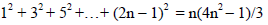

# 7th laboratory work on the subject "Visual software development tools"
## Project on c++/Qt(Qt Quick)/CMake

## Task 1

Calcualte volume of oxygen in room.
Oxygen take 21% of volume of room.
Width, heigth and length should be entered by user.

## Task 2

Get sign of cos(x) by selected coordinate quarter.

## Task 3

Calculate number row by formula of row or by formula of general item

## Task 4

Create or edit train list.
Train's fields:
* destination
* train number
* departure time

There should be possible to write list into file or read from it.